## 官方文档 
http://babeljs.io/docs/setup/#installation


## 准备工作
1. webstorm IDE
2. node环境  (不会戳这里 http://blog.csdn.net/wx11408115/article/details/76609889) 
3. npm 的一些基本操作


## 1. 新建一个空项目
## 2. 新建个main.js 作为测试文件并写两句ES6代码

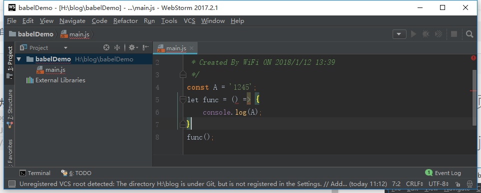
 
 报红啦！！！
 不捉急。

## 3. 设置ES6
选择左上角 File ——> Setting——>Language &Frameworks ——>JavaScript——>选择ECMA6——>Apply——>OK

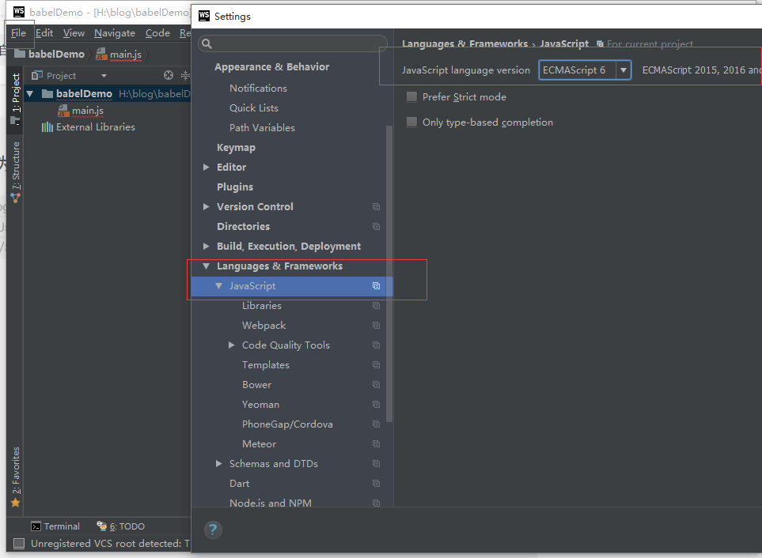

再回头看main.js文件是不是不报红啦？ 
(ps:*稍微改了下文字*)
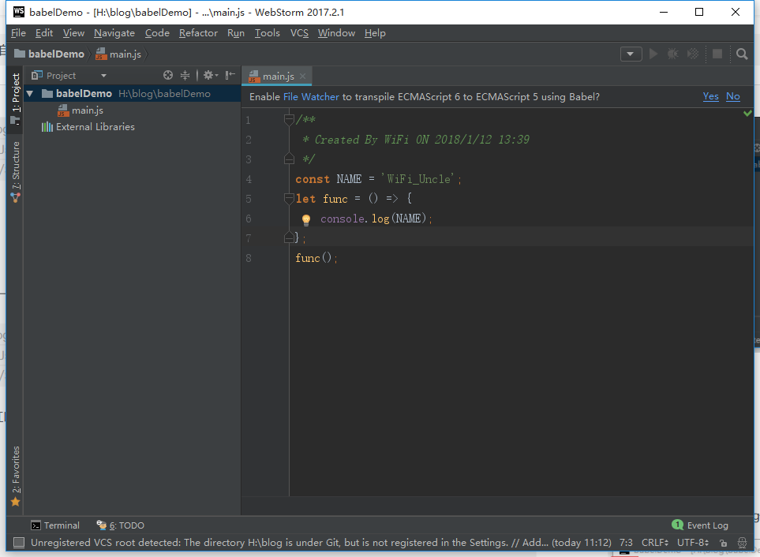

## 4. npm init 

```
npm init
```
执行该命令，里面的提示可以填，也可以一路回车键，直到yes

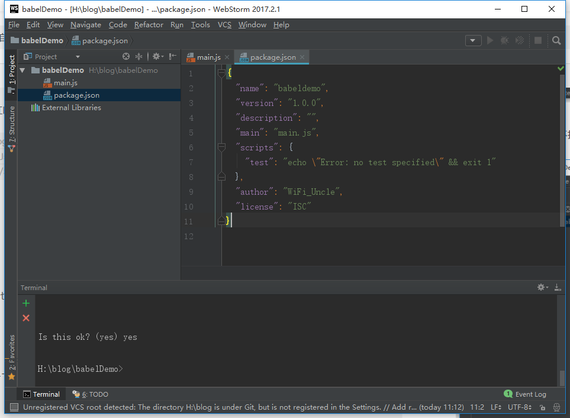


## 5. 安装

```
npm install --save-dev babel-cli
```
执行完毕后，看看package.json 里是不是多了东西？？？
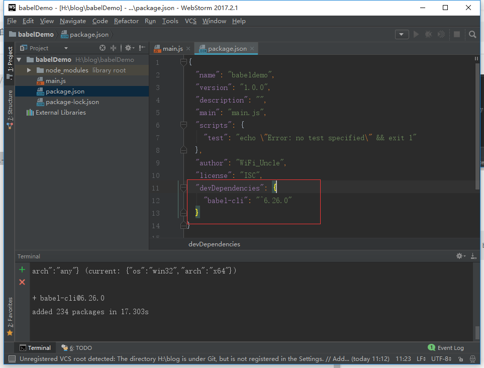

## 6. 添加File Watchers
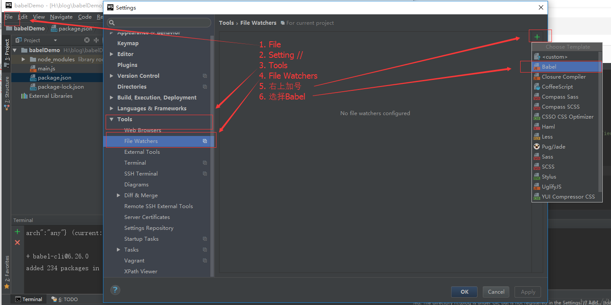
 File ——> Setting——>Tools ——>File Watchers——>加号——>Babel 然后弹框
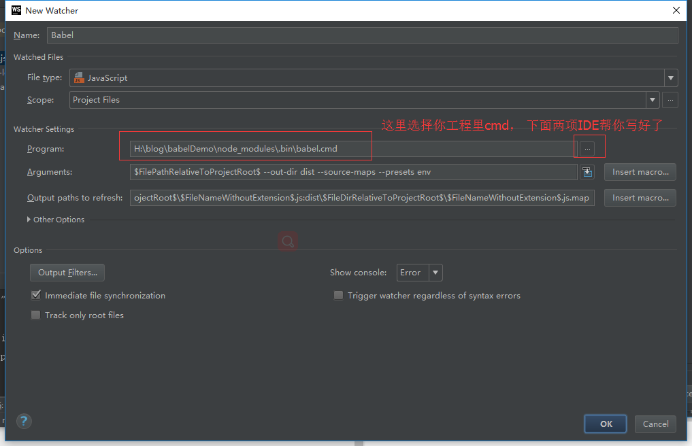
然后就Apply  ——>OK——>OK  
切记一定要点击确定呐！ 不然白忙活了

我把里面三句贴出来，以防有些童鞋IDE没有自己生成，这样可以直接拷过去

```
H:\blog\babelDemo\node_modules\.bin\babel.cmd //要改成你工程babel.cmd 的位置

$FilePathRelativeToProjectRoot$ --out-dir dist --source-maps --presets env

dist\$FileDirRelativeToProjectRoot$\$FileNameWithoutExtension$.js:dist\$FileDirRelativeToProjectRoot$\$FileNameWithoutExtension$.js.map

//自己对号入座哈，
```
## 7. 在工程根目录下，新建名为  .babelrc 的文件

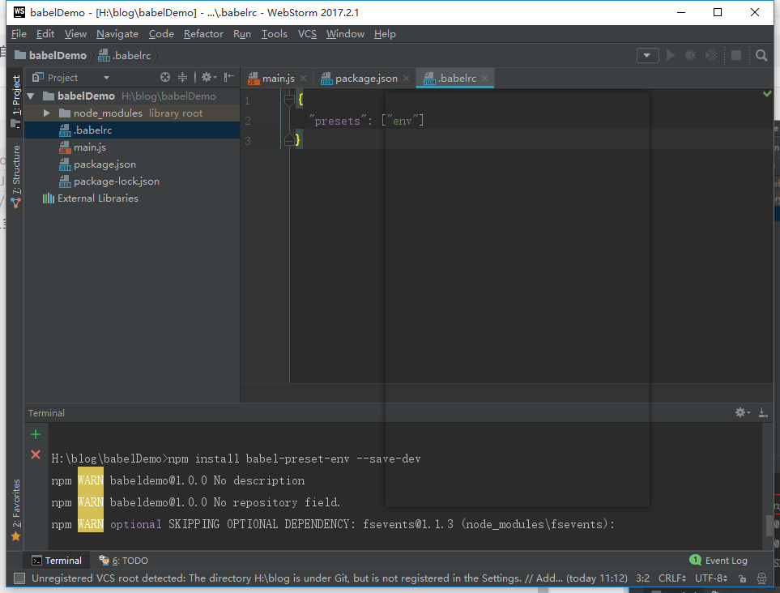
打开文件，把下面的配置贴进去，保存。

```
{
  "presets": ["env"]
}
```

## 8. 安装 babel-preset-env

```
npm install babel-preset-env --save-dev
```

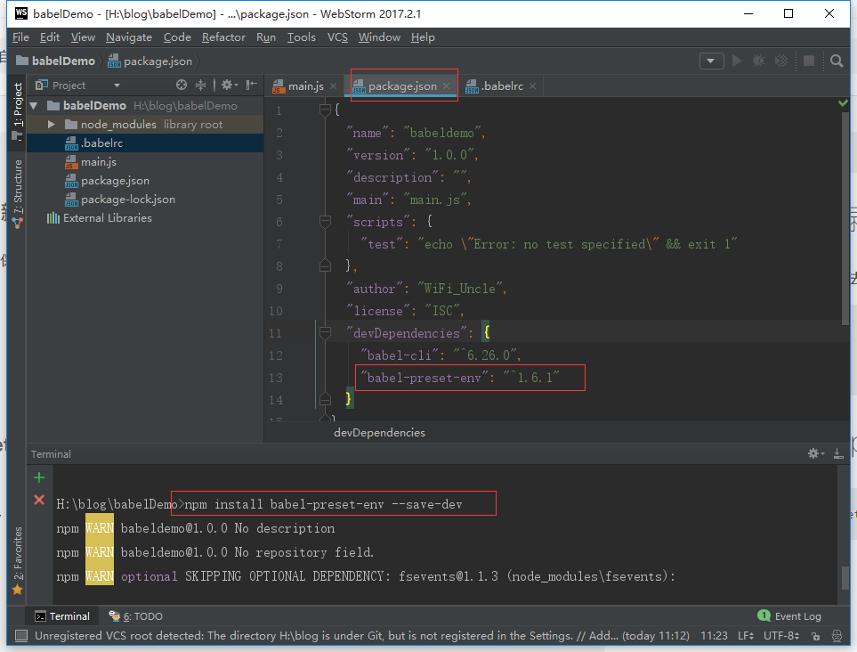
瞅瞅，是不是package.json中，又多了一点东西？ 正是你刚刚安装的

##9.  安装babel-preset-es2015

```
npm install  babel-preset-es2015 --save-dev

```
刚刚控制台说，现在推荐使用 babel-preset-env 

```
npm WARN deprecated babel-preset-es2015@6.24.1: ????  Thanks for using Babel: we recommend using babel-preset-env now: please read babeljs.
io/env to update!

```

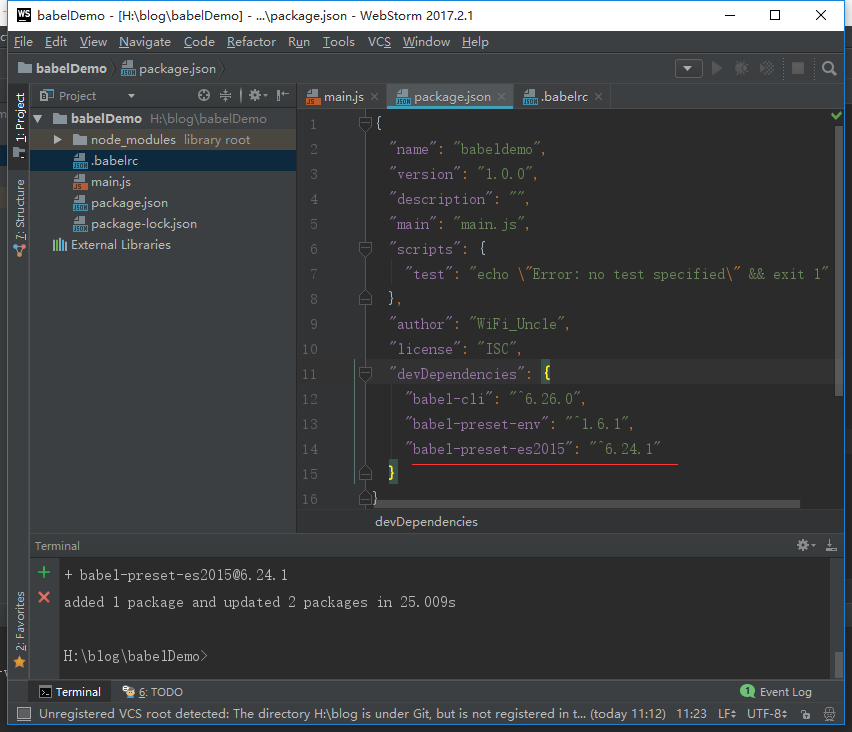

看，又增加了~~~

## 测试
现在我们开始测试一下，把main.js文件稍微改点东西，然后ctrl +s 保存，目录是不是多了个dist文件夹，里面还有编译好的文件，是不是有点小鸡冻呢？？？
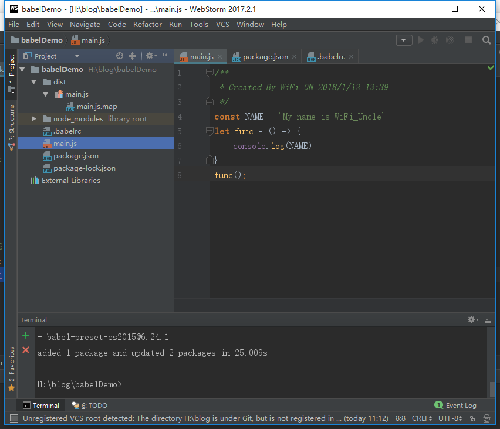
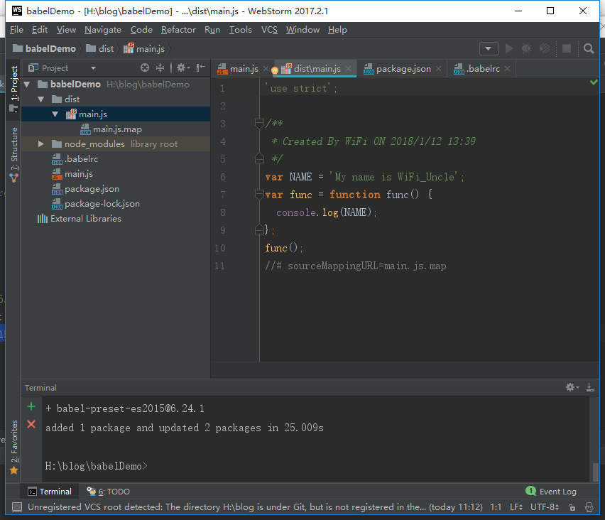

