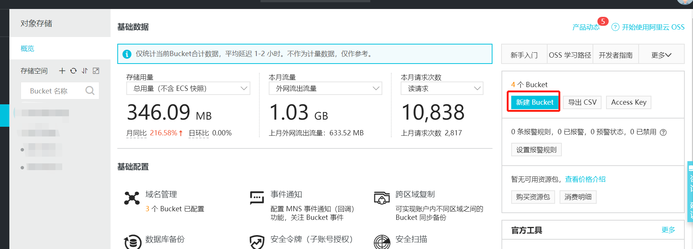
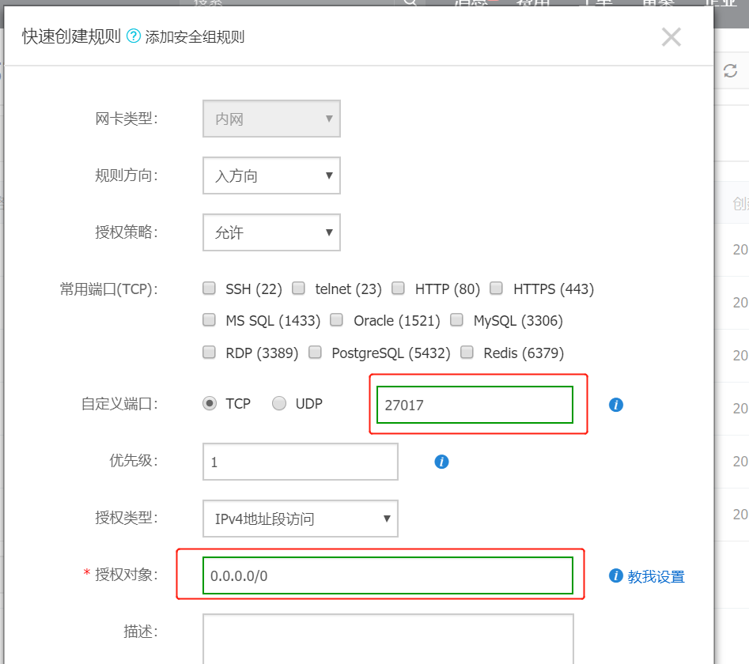

**写在前面**

文章有丢丢长，前端开发第一次部署项目，有问题请及时提出，以免误导其他童鞋，轻拍~，

### 更新系统
`sudo yum update`

### 安装mongo
#### 1. 添加MongoDB源
在/etc/yum.repos.d/下创建名为mongodb-org-4.0.repo文件。并在文件中添加如下内容
>[mongodb-org-4.0]
name=MongoDB Repository
baseurl=https://repo.mongodb.org/yum/redhat/$releasever/mongodb-org/4.0/x86_64/
gpgcheck=1
enabled=1
gpgkey=https://www.mongodb.org/static/pgp/server-4.0.asc
#### 2. 安装
>sudo yum install -y mongodb-org
#### 3. 配置MongoDB及其他
MongoDB的配置文件位于/etc/mongod.conf
```
# network interfaces
net:
  port: 27017
  bindIp: 127.0.0.1  # Enter 0.0.0.0,:: to bind to all IPv4 and IPv6 addresses or, alternatively, use the net.bindIpAll setting.
```
把127.0.0.1 改成0.0.0.0, 原因见注释。


**启动和停止MongoDB**

```
sudo systemctl start mongod
sudo systemctl restart mongod
sudo systemctl stop mongod
```
**设置开机自启**
```
sudo systemctl enable mongod
```
#### 4. 配置阿里云服务器端口
此项不是必须，本地连接远程数据库调试、查看方便些就开启
由于centos只开启了一些基础端口(如80)，其他都关闭，要自己配置。
(当时我明明把mongodb启动了，本地就是访问不了远程)

顺便把你后台接口端口开下。
(配置端口方法在文末)

#### 5. 验证
(阿里云没开端口就访问不了)
在自己浏览器中输入你服务器地址加端口号，例如: http://133.xxx.xx.xx:27017，若界面友好，如出现
>It looks like you are trying to access MongoDB over HTTP on the native driver port.

恭喜你，完成！


**安装详细及安全认证请点击** https://cloud.tencent.com/developer/article/1329170

**官方文档传送门**: https://docs.mongodb.com/manual/tutorial/install-mongodb-on-red-hat/


#### 6. 基本操作
##### 创建数据库 ，不存在会创建，不建立集合又会删除
> use mydb;  

switched to db mydb

##### 创建集合
> db.createCollection('a') 

{ "ok" : 1 }

##### 在集合中插入数据
> db.a.insert({"id":1,"name":"zhangsan"}) 

WriteResult({ "nInserted" : 1 })

##### 查看集合中的数据
> db.a.find() 

##### 查找指定记录并赋予别名a，查看属性类型
> b=db.a.findOne({"id":1})
{
    "_id" : ObjectId("5b4c54bc8a4352592ecc288f"),
    "id" : 1,
    "name" : "zhangsan"
}
> typeof(b.id)
number 

##### 更改数据
> db.a.update({"id":1},{$set:{"name":"tom"}})  
WriteResult({ "nMatched" : 1, "nUpserted" : 0, "nModified" : 1 })
> db.a.find()
{ "_id" : ObjectId("5b4c54bc8a4352592ecc288f"), "id" : 1, "name" : "tom" }

##### 查看集合
> show collections  
a

##### 删除集合
> db.a.drop()  
true

##### 删除数据库
> db.dropDatabase() 
{ "dropped" : "mydb", "ok" : 1 }

##### 复制数据库
> db.copyDatabase("mydb","mydb1")  
{ "ok" : 1 }
> show dbs;
admin  0.000GB
config  0.000GB
local  0.000GB
mydb    0.000GB
mydb1  0.000GB

**注** 基本操作源于网上，地址不记得在哪里(以前复制的笔记) 

---

### 安装node
#### 安装Nodejs ---- v10.15.0版本
```
# cd /opt/app
# mkdir nodejs
# cd nodejs 
# wget https://npm.taobao.org/mirrors/node/v10.15.0/node-v10.15.0-linux-x64.tar.xz    // 下载
# tar xf  node-v10.15.0-linux-x64.tar.xz       // 解压
# cd node-v10.15.0-linux-x64/                  // 进入解压目录
# ./bin/node -v                               // 执行node命令 查看版本

```
#### 设置软连接

```
# ln -s /opt/app/nodejs/node-v10.15.0-linux-x64/bin/npm   /usr/local/bin/ 
# ln -s /opt/app/nodejs/node-v10.15.0-linux-x64/bin/node   /usr/local/bin/
```
#### 安装taobao镜像
`npm config set registry https://registry.npm.taobao.org`

**验证下**

`npm config get registry`

参考链接: https://blog.51cto.com/1693346/2344694?source=dra 

(他那个少了写了cd nodejs 步骤，会导致设置软连接失败，设置软连接node程序路径上有nodejs文件夹)

---

### 安装git
**此项非必须。**
由于本项目是通过git做版本控制，若直接复制文件到服务器就不用安装git
#### 1.安装
`yum install -y git`

安装完成后，输入`git`试下，

#### 2.卸载
`yum remove git`


---

### http-server 服务器
#### 全局安装

>npm install http-server -g
#### 用法

>http-server [path] [options]

`[path] 默认路径: 如果当前目录有public文件夹，则path为./public, 否则path为当前目录./`

#### 配置项

配置 | 名称 | 默认值
---|---|---
-p | 端口 | 8080
-a | 地址 |  0.0.0.0

*举个栗子*
>http-server -a 0.0.0.0 -p 8000

**注意:** 启动后台服务，该端口一定要在阿里云配置，否则访问不了(配置端口方法在文末)

官方文档: https://www.npmjs.com/package/http-server


---
基本工作已完成。
### 开始部署
>  
```
# cd /var/www/html/    //没有该目录则新建 mkdir 文件夹名
# git clone 项目地址
# npm i
# npm run build
# http-server -a 0.0.0.0 -p 8080 //后端服务
# cd dist/
# http-server -a 0.0.0.0 -p 80 // 前端代码

```

### 其他
途中遇到几个问题
1. 远程终端开启服务，关了终端服务就停了
2. npm i 各种问题，改用yarn包管理
3. 配置域名
4. 服务器有点慢，用oss静态文件托管
5. 阿里云服务器怎么开端口

---
#### 问题1: 远程终端开启服务，关了终端服务就停了
##### 1.安装forever

>npm install forever -g

```
[root@iZ2ze7ggih5sha1231siavrvZ hope]# npm install forever -g
/opt/app/node-v10.15.0-linux-x64/bin/forever -> /opt/app/node-v10.15.0-linux-x64/lib/node_modules/forever/bin/forever
npm WARN optional SKIPPING OPTIONAL DEPENDENCY: fsevents@1.2.8 (node_modules/forever/node_modules/fsevents):
npm WARN notsup SKIPPING OPTIONAL DEPENDENCY: Unsupported platform for fsevents@1.2.8: wanted {"os":"darwin","arch":"any"} (current: {"os":"linux","arch":"x64"})

+ forever@1.0.0
added 247 packages from 152 contributors in 13.696s
```
##### 2. 使用

```
[root@iZ2ze7ggih5sha13siavrvZ bin]# forever
-bash: forever: command not found
```
咦？ 找不到命令？

**原因:** 未设置软连接(类似window中的快捷方式)
```

[root@iZ2ze7ggih5sha1231siavrvZ bin]# ln -s /opt/app/node-v10.15.0-linux-x64/bin/forever  /usr/local/bin/  //别直接复制我这句！得看你的forever装在哪里，安装位置看安装时打印的日志，如我上面显示。

[root@iZ2ze7ggih5sha1231siavrvZ bin]# forever 
help:    usage: forever [action] [options] SCRIPT [script-options]
help:    
# 以下省略····
```
`ln -s 程序bin所在位置   复制到目标位置`   //ln 理解为link -s  save (个人理解) 

**启动服务**
```
forever start app.js  //启动
forever stop app.js  //关闭
forever list // 查看启动的服务列表

forever -h //不会操作就找help吧~

```

forever 官方： https://github.com/foreverjs/forever

---
#### 问题2：npm 包管理改成yarn包管理
##### 安装
`npm install yarn -g`
##### 设置软链接
` ln -s /opt/app/node-v10.15.0-linux-x64/bin/yarn  /usr/local/bin/ ` //别直接复制，先看自己yarn bin在哪


npm 常用命令对比
npm | yarn | 作用
---|---|---
npm install	| yarn install | 安装所有模块
npm install [package] 	| 	yarn add [package] | 添加模块
npm install [package] --save-dev	| 	yarn add [package] --dev | 添加模块
npm uninstall [package]		|  yarn remove [package] | 卸载模块

具体用法详见官方文档: https://yarnpkg.com/zh-Hans/docs/usage

#### 3. 配置域名
阿里云后台-->域名管理-->解析-->添加记录-->剩下的一步步看就好了


#### 4. 用oss(文件对象存储)静态文件托管
前端代码可直接托管到oss，速度快。流量比较大的就开启cdn，毕竟流量也要钱。
1. 阿里云后台-->对象存储-->新建bucket(一定要设置成公有读，不然访问还得带鉴权？)
2. 右侧bucket列表 ---》概览--->访问域名-->复制bucket域名&&外网访问的那个地址，在自己域名管理中解析到这地址
3. -->基础设置--->静态页面-->设置首页
4. --->基础设置旁边的域名管理-->绑定你的域名




#### 5. 阿里云服务器怎么开端口
假设你已经看到右侧列表是
- 实例详情
- 本实例磁盘
- 本实例快照
- 本实例弹性网卡
- 本实例安全组
- 本实例安全防护

1. 本实例安全防护 --->安全组列表--->配置规则-->快速创建规则-->填写你的端口号，授权对象填0.0.0.0/0 

以上就是全部内容啦~




